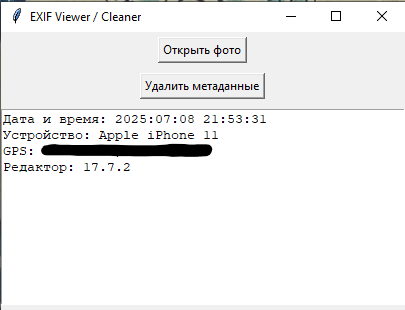

# EXIF Inspector

A lightweight desktop utility written in **Python** for viewing and removing EXIF metadata from image files. The application provides quick access to commonly used metadata fields such as capture time, camera information, GPS coordinates, and image processing software.

<p align="center">
  
</p>

---

## Features

-  View EXIF metadata from JPEG images.
-  Display original capture date and time.
-  Show camera manufacturer and model.
-  Extract GPS coordinates (if available).
-  Display image editing software information.
-  Remove all EXIF metadata while preserving image content.
-  Simple graphical interface built with Tkinter.

---

## Technologies

- Python 3
- Tkinter
- Pillow (PIL)
- piexif

---

## Skills Demonstrated

- EXIF metadata parsing
- Image processing
- GPS coordinate conversion
- GUI development with Tkinter
- File handling
- Metadata sanitization

---

## Supported Formats

### Input

- JPG
- JPEG
- HEIC *(metadata reading only)*
- MOV *(selection supported)*

### Output

- JPG
- JPEG

---

## Displayed Metadata

The application extracts the following information when available:

- Original capture date and time
- Camera manufacturer
- Camera model
- GPS coordinates
- Image editing software

---

## Installation

```bash
pip install -r requirements.txt
```

---

## Usage

```bash
python exif_tool.py
```

---

## Purpose

This project was created as a simple utility for inspecting and sanitizing image metadata. It demonstrates working with EXIF structures, metadata extraction, coordinate conversion, basic image processing, and desktop GUI development in Python.
